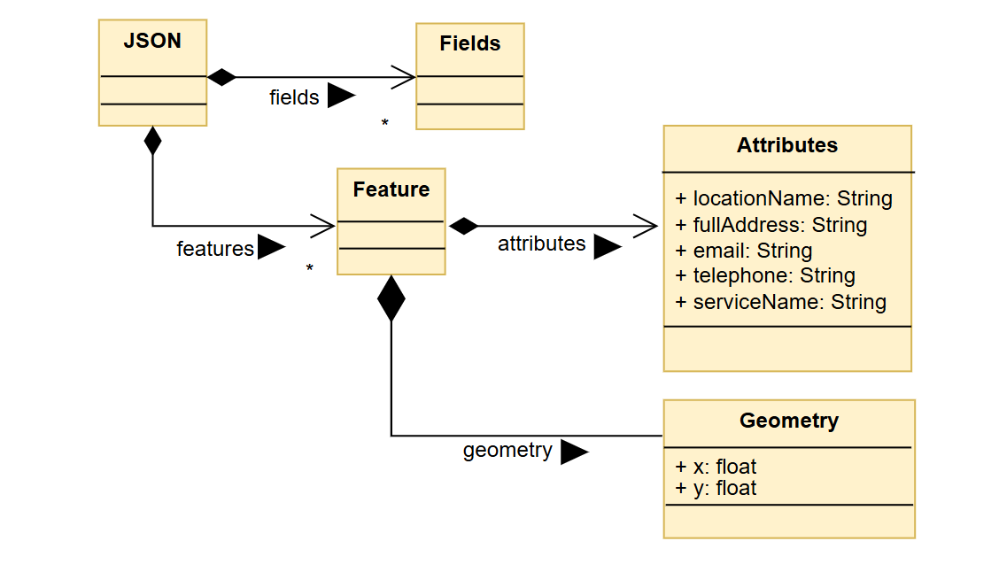

# Implementation


## Introduction
Dataset Description - The system for the debt advice agencies implements structured data from multiple sources. These include: 
 * Primary Data Sources - Open Gov Data (this provides publically available debt agency records), and direct content from the debt agencies.
 * Dataset  Structure - User Data Table (This stores the users notes,and bookmarks), System Configurations Table(This stores the themes, and filtering options), and Debt Agencies Table (This stores the agencies details such as name, location, availability, and contact info).

The current issues that the system has deals with data accuracy and updates that occur, as the agencies change their contact details, location, and services. Thus some information on the site can become outdated, requiring constant updates. The other potential issue we have to face is scalability because if the user base grows rapidly, the hosting requirements and system performance may need to be expanded.


### Configuration Data 
 * User Preferences: UI themes (light/dark mode), and font size customization
 * Map and Location Settings: API keys for map intergration (Mapbox) and the default city, Bristol
 * Filters and Search Settings: Filter options (e.g., availability and postcode) and sorting options (e.g., most affordable, and highly rated)
 * Admin Settings: moderation rules for agency updates 


## Project Structure

Project Folder Structure for the Debt Advice Agency Finder System 
```
    └── 📁Group project
        └── 📁code 
            └── 📁app   //this is the folder for all the implementation files
                └── index.html  //The main html page for the implementation stage which contains the listings of agencies
                └── pages.html
                └── script.js //The JavaScript file containing the functions that make the html pages interactive
                └── style.css   //The styling sheet for the html pages
                └── toc.html 
            └── 📁mockup   //this is the folder for all the mock up files
                └── mockup.html     //The static page version for the website
                └── script.js
                └── style.css
            └── 📁prototype     //this is the folder for all the prototypes files
                └── map.html
                └── profile.html
                └── prototype.html
                └── script.js
                └── style.css
            └── 📁docs  //All the documentation for the project
                └── design.md
                └── implementation.md
                └── planning.md
                └── requirements.md
                └── testing.md
            └── 📁images    //This is the folder for all the images used in this project
                └── ComponentDiagram.png
                └── contextdiagram.png
                └── postcodeUML.png
                └── UC1.png
                └── UC2.png
                └── UC3.png
                └── UC4.png
                └── UC5.png
                └── UC6.png
                └── umldiagram.png
                └── usecase.png
            └── readme.md
```


//This needs to be worked on
### provide a table listing the number of jslint warnings/reports for each module.

Strings must use doublequote.  (quotes)

'closeModal' is defined but never used.  (no-unused-vars)
Remove unused variable 'closeModal'.

'showSection' is defined but never used.  (no-unused-vars)
Remove unused variable 'showSection'.


///This needs to be worked on
## Software Architecture
Debt Agency Finder -  This is the main system we created that is responsible for fetching and displaying the debt advice agencies' information. It sends the request to external data sources via APIs and uses UI components to display data(e.g, maps tables, search).
Query Component -  A query is a request sent from the Debt Agency Finder to the Open Data Bristol(this is an external data source) API to get information about debt advice agencies.This component represents API calls made from the Debt Agency Finder to Open Data Bristol. Thus, the connection from the Debt agency finder to Open Data Bristol is represented by a dashed line to indicate its dependency on it.
Mapbox-GL Component - This represents the Mapbox-GL library, which is used for an interactive mapping. The debt agency finder queries Mapbox to render map-based visualizations to it and this integration enables users to locate the debt agencies.
External Services -  Open Data Bristol and Mapbox: Open Data provides sructured data about the debt agencies and Mapbox offers mapping functionalities to visualize the agency locations.


## Bristol Open Data API
TODO: Document each query to Bristol Open Data

**Query URL Link:** [Postcode Query](https://maps2.bristol.gov.uk/server2/rest/services/ext/ll_community_and_safety/MapServer/18/query?where=1%3D1&outFields=LOCATION_NAME,FULL_ADDRESS,SERVICE_NAME,TELEPHONE,EMAIL&outSR=4326&f=json)



**Query URL Link:** [Postcode Query](https://maps2.bristol.gov.uk/server2/rest/services/ext/ll_community_and_safety/MapServer/18/query?where=1%3D1&outFields=POSTCODE&outSR=4326&f=json)


//This can only be done once our code pages are made //Still needs working on
# User guide
TODO: Explain how each use-case works by providing step-by-step screenshots for each use-case. This should be based on a tested scenario.